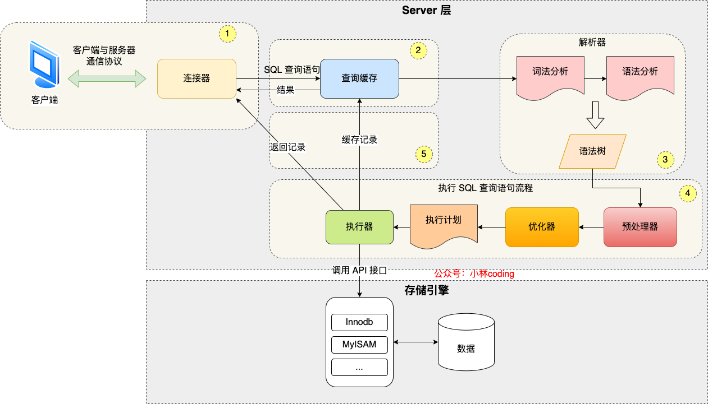
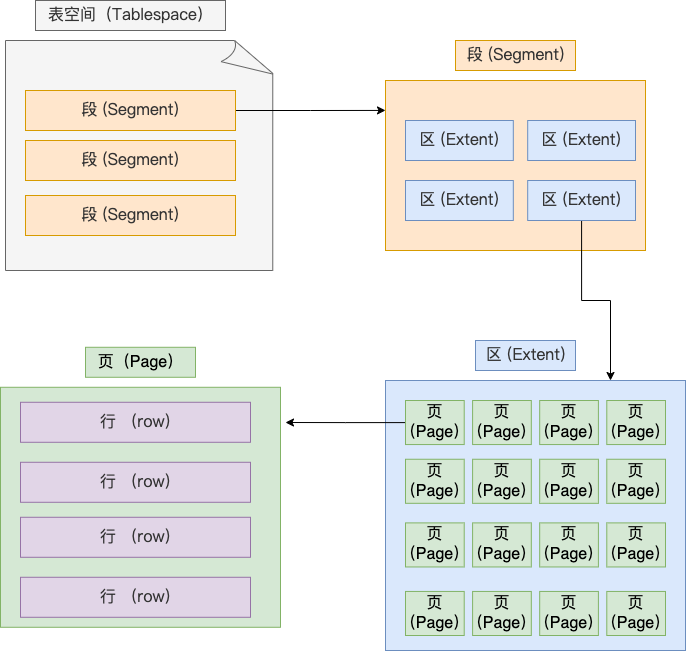
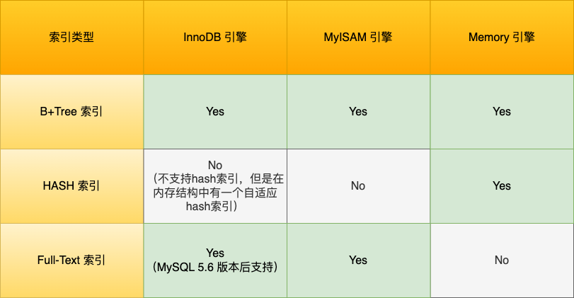
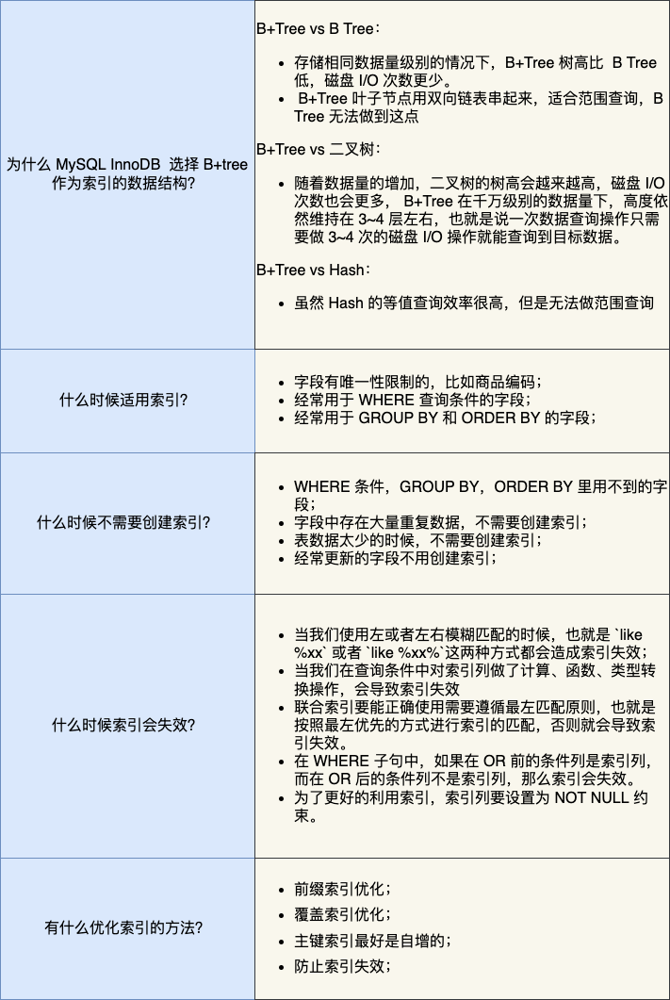
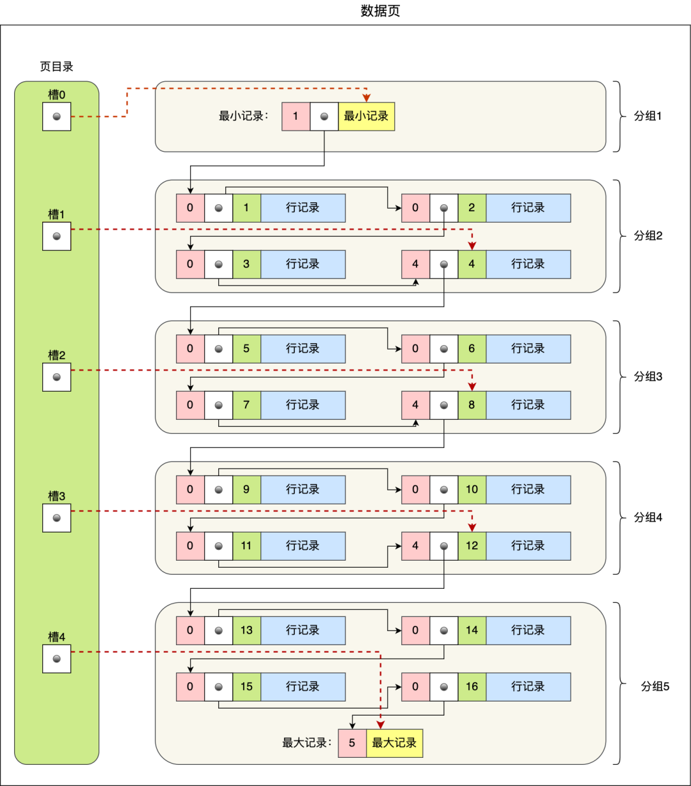
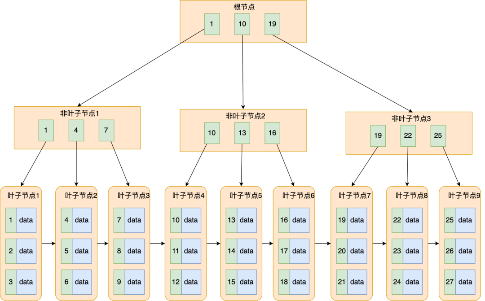
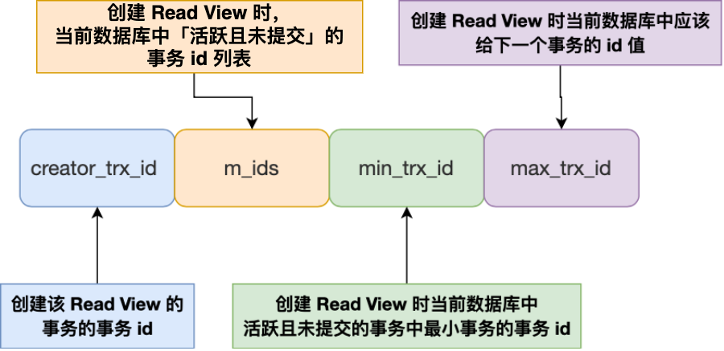
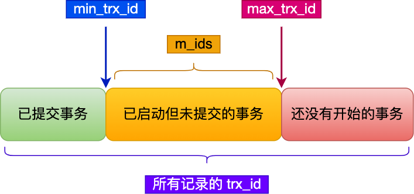
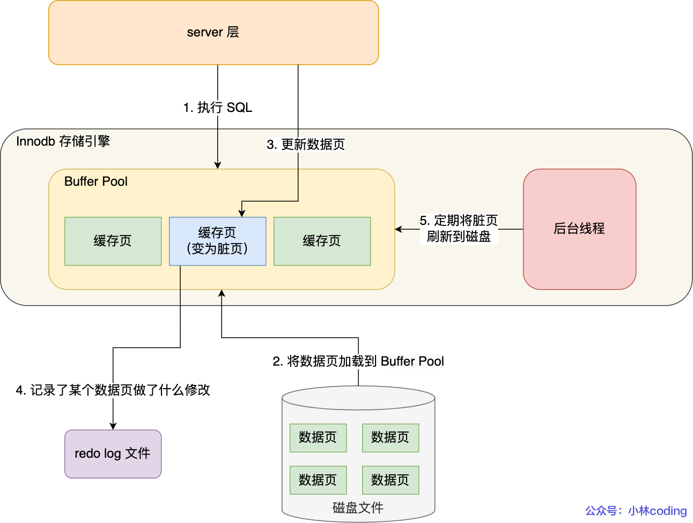
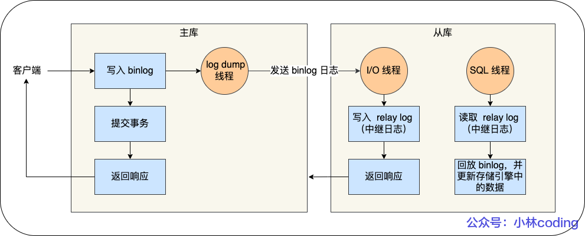

# 小林coding

## MySQL总体架构图



分为Server层和存储引擎层

- Server层负责连接、分析、执行SQL。包括**连接器、查询缓存（8.0后取消）、解析器、预处理器、优化器、执行器**等。
- 存储引擎层负责数据的存储和提取。主流的存储引擎有**InnoDB、MyISAM、Memory**等，MySQL5.5之后默认的存储引擎是InnoDB。


### 连接器

MySQL是基于TCP协议传输的

```nginx
mysql -h$ip -u$user -p  	# 连接命令
mysql> show processlist;	# 查看服务被多少个客户端连接
mysql> kill connection +id	# 手动断开空闲连接
```

`wait_timeout`控制空闲连接的最大空闲时长，默认8小时，超过此时间连接器会自动断开该连接（也可以手动断开）。

` max_connections`控制最大连接数。

MySQL如HTTP一般也有短链接和长连接的区别，一般推荐使用长连接，减少建立和断开的过程。但是**长连接会占用内存**。解决方式：1、定期断开长连接；2、客户端主动重置连接：MySQL 5.7 版本实现了`mysql_reset_connection()` 函数的接口，不需要重连和重新鉴权，但是可以释放内存。

> **总结**
>
> - 与客户端进行 TCP 三次握手建立连接；
> - 校验客户端的用户名和密码，如果用户名或密码不对，则会报错；
> - 如果用户名和密码都对了，会读取该用户的权限，然后后面的权限逻辑判断都基于此时读取到的权限；


### 查询缓存

对于更新比较频繁的表，查询缓存的命中率很低的，因为只要一个表有更新操作，那么这个表的查询缓存就会被清空。因此，**MySQL 8.0**直接将查询缓存删掉了。


### 解析器

- **词法分析**：识别SQL语句关键字，构建SQL语法树
- **语法分析**：判断语句是否合乎语法


### 预处理器

- 检查表或字段是否存在
- 将 `select *` 中的 `*` 符号，扩展为表上的所有列


### 优化器

**优化器主要负责将 SQL 查询语句的执行方案确定下来**，比如在表里面有多个索引的时候，优化器会基于查询成本的考虑，来决定选择使用哪个索引。

要想知道优化器选择了哪个索引，我们可以在查询语句最前面加个 `explain` 命令。

```mysql
explain select * from table where id = 1;
```


### 执行器

确认用户权限后，根据执行计划执行 SQL 查询语句，从存储引擎读取记录，返回给客户端

- 主键索引查询
- 全表扫描
- 索引下推（MySQL 5.6 推出的查询优化策略）：索引下推能够减少**二级索引**在查询时的回表操作，提高查询的效率，因为它将 Server 层部分负责的事情，交给存储引擎层去处理了。


## MySQL一行记录的存储结构

### 存放的文件

- db.opt：存储当前数据库的默认字符集和字符校验规则（8.0版本后无）
- 表名.frm：存放该表的表结构（8.0版本后无）
- 表名.ibd：存放该表的表数据


### 表空间文件结构



一条记录按行存储，但是按页来读写

页是 InnoDB 存储引擎磁盘管理的最小单元。每个页默认大小为16kb

但在表中数据量大的时候，为某个索引分配空间的时候就不再按照页为单位分配了，而是按照**区（extent）**为单位分配。每个区的大小为 1MB，对于 16KB 的页来说，连续的 64 个页会被划为一个区，这样就使得链表中相邻的页的物理位置也相邻，就能使用顺序 I/O 了。

段被分为**索引段、数据段、回滚段**，索引段存放B+树非叶子节点的区的集合；数据段存放B+树叶子节点的区的集合；回滚段存放的是回滚数据的区的集合。


### InnoDB行格式

- **Redundant**：5.0版本前古老的行格式
- **Compact**：紧凑的行格式，一个数据也可以存放更多行记录
- **Dynamic、Compressed**：类似Compact，5.7版本后默认Dynamic


### Compact行格式


#### 记录的格外信息

##### 1. 变长字段长度列表

char 是定长的，varchar 是变长的。因此这个字段存放的是`varchar`型的字段。但这个字段不是必须的，如果数据表没有`varchar`型字段，就不需要这个列表。

变长字段的真实数据占用的字节数会按照列的顺序**逆序存放**。

NULL不会存放在行格式中记录的真实数据部分里，因此变长字段长度列表里不需要保存值为 NULL 的变长字段的长度。

> **为什么「变长字段长度列表」的信息要按照逆序存放？**
>
> 这样可以使得位置靠前的记录的真实数据和数据对应的字段长度信息可以同时在一个 CPU Cache Line 中，这样就可以提高 CPU Cache 的命中率。

##### 2. NULL值列表

同样需要**逆序存放**。同样也不是必须的，如果数据表所有字段都是NOT NULL，就不需要这个列表。

如果存在允许 NULL 值的列，则每个列对应一个二进制位（bit）。NULL 值列表必须用整数个字节的位表示（1字节8位），如果使用的二进制位个数不足整数个字节，则在字节的高位补0。

##### 3. 记录头信息

- delete_mask：标识此条数据是否被删除。删除了标记为1。
- next_record：下一条记录的位置。从这里可以知道，记录与记录之间是通过链表组织的。
- record_type：表示当前记录的类型，0表示普通记录，1表示B+树非叶子节点记录，2表示最小记录，3表示最大记录。

#### 记录的真实数据

三个隐藏字段：

- row_id：如果我们建表的时候指定了主键或者唯一约束列，那么就没有row_id隐藏字段了。如果既没有指定主键，又没有唯一约束，那么InnoDB就会为记录添加row_id隐藏字段。row_id**不是必需**的，占用6个字节。

- trx_id：事务id，表示这个数据是由哪个事务生成的。trx_id**是必需**的，占用6个字节。

- roll_pointer：这条记录上一个版本的指针。roll_pointer是必需**的，占用7个字节。


### varchar(n)中n的最大取值

**MySQL 规定除了 TEXT、BLOBs 这种大对象类型之外，其他所有的列（不包括隐藏列和记录头信息）占用的字节长度加起来不能超过 65535 个字节**。65535限制的是一行总长度，不是一列。

varchar(n)字段类型的n代表的是最多存储的**字符数量**，并不是字节大小。要算varchar(n)最大能允许存储的字节数，还要**看数据库表的字符集**，比如ascii字符集，1个字符占用1字节，那么varchar(100)意味着最大能允许存储100字节的数据。

一行数据最大字节 = **变长字段长度列表 + NULL 值列表 + varchar(n)** 所占用字节数

> - 如果变长字段允许存储的最大字节数小于等于255字节，就会用1字节表示变长字段长度；
> - 如果变长字段允许存储的最大字节数大于255字节，就会用2字节表示变长字段长度；


### 行溢出的处理方式

一个页最多存16384字节，一个varchar(n)最多存65532字节，则一个页可能存不下一条记录，这时会发生行溢出，多出来的数据会被存到**溢出页**中。在真实数据页处用20字节指向溢出页地址。


## 索引

### 索引分类

- 按「数据结构」分类：**B+tree索引、Hash索引、Full-text索引**。
- 按「物理存储」分类：**聚簇索引（主键索引）、二级索引（辅助索引）**。<font color=red>（B+树）?</font>
- 按「字段特性」分类：**主键索引、唯一索引、普通索引、前缀索引**。
- 按「字段个数」分类：**单列索引、联合索引**。

#### 按数据结构分类



在创建表时，InnoDB 存储引擎会根据不同的场景选择不同的列作为索引：

- 如果有主键，默认会使用主键作为聚簇索引的索引键（key）；
- 如果没有主键，就选择第一个不包含 NULL 值的唯一列作为聚簇索引的索引键（key）；
- 在上面两个都没有的情况下，InnoDB 将自动生成一个隐式自增 id 列作为聚簇索引的索引键（key）；

其它索引都属于辅助索引（Secondary Index），也被称为二级索引或非聚簇索引。**创建的主键索引和二级索引默认使用的是 B+Tree 索引**。

> **索引数据结构对比**
>
> 1. B+树 vs B树
>    B+树只在叶子节点存储数据，而B树的非叶子节点也要存储数据，所以B+树的单个节点的数据量更小，在相同的磁盘I/O次数下，就能查询更多的节点。另外，B+树叶子节点采用的是双链表连接，适合MySQL中常见的基于范围的顺序查找，而B树无法做到这一点。
>
> 2. B+树 vs 二叉树
>    对于有N个叶子节点的B+树，其搜索复杂度为$O(log_dN)$，实际情况下，d值大于100。而二叉树搜索复杂度为$O(logN)$，需要更多I/O次数。
>
> 3. B+树 vs 哈希
>    Hash 在做等值查询的时候效率贼快，搜索复杂度为 O(1)。但是 Hash 表不适合做范围查询，它更适合做等值的查询。

#### 按物理存储分类

分为主键索引（聚簇索引）和二级索引（辅助索引）

二级索引B+树叶子节点存放的是主键值，因此如果查询的数据在二级索引里查询不到，就需要返回到主键索引树继续查找，这个过程叫做回表。

#### 按字段特性分类

分为主键索引、唯一索引、普通索引、前缀索引。

##### 主键索引

一张表最多只有一个主键索引，索引列的值不允许有空值。

```mysql
CREATE TABLE table_name  (
  ....
  PRIMARY KEY (index_column_1) USING BTREE
);
```

##### 唯一索引

是建立在UNIQUE字段上的索引，一张表可以有多个唯一索引，索引列的值必须唯一，但是允许有空值。

```mysql
# 建表时创建唯一索引
CREATE TABLE table_name  (
  ....
  UNIQUE KEY(index_column_1,index_column_2,...) 
);
# 建表后创建唯一索引
CREATE UNIQUE INDEX index_name
ON table_name(index_column_1,index_column_2,...);
```

##### 普通索引

是建立在普通字段上的索引，既不要求字段为主键，也不要求字段为 UNIQUE。

```mysql
# 建表时创建普通索引
CREATE TABLE table_name  (
  ....
  INDEX(index_column_1,index_column_2,...) 
);
# 建表后创建普通索引
CREATE INDEX index_name
ON table_name(index_column_1,index_column_2,...); 
```

##### 前缀索引

前缀索引是指对字符类型字段的前几个字符建立的索引，而不是在整个字段上建立的索引，前缀索引可以建立在字段类型为 char、 varchar、binary、varbinary 的列上。使用前缀索引的目的是为了**减少索引占用的存储空间**，提升查询效率。

```mysql
# 建表时创建前缀索引
CREATE TABLE table_name(
    column_list,
    INDEX(column_name(length))
); 
# 建表后创建前缀索引
CREATE INDEX index_name
ON table_name(column_name(length)); 
```

#### 按字段个数分类

分为单列索引、联合索引（复合索引）

- 建立在单列上的索引称为单列索引，比如主键索引
- 建立在多列上的索引称为联合索引

```mysql
CREATE INDEX index_product_no_name ON product(product_no, name);
# 联合索引查询的 B+Tree 是先按 product_no 进行排序，然后再 product_no 相同的情况再按 name 字段排序。
```

##### 最左匹配原则

按照最左优先的方式进行索引的匹配。在使用联合索引进行查询的时候，如果不遵循最左匹配原则，联合索引会失效，这样就无法利用到索引快速查询的特性了。

##### 联合索引范围查询几个例子

**1.  `select * from t_table where a > 1 and b = 2`，联合索引（a, b）**
	a : 按a字段排序，因此符合a > 1的肯定相邻，所以a字段使用了联合索引查询
	b : 但是a > 1的条件里，b是无序的，所以b没有用到联合索引查询

**2. `select * from t_table where a >= 1 and b = 2`，联合索引（a, b）**
	a : 同理a字段使用了联合索引查询
	b : 虽然在a > 1的条件里，b是无序的，但是在a = 1的条件里，b是有序的，所以b用到了联合索引查询

**3. `SELECT * FROM t_table WHERE a BETWEEN 2 AND 8 AND b = 2`，联合索引（a, b）**
	a : 使用了
	b : 使用了

**4. `SELECT * FROM t_user WHERE name like 'j%' and age = 22`，联合索引（name, age）**
	name : 前缀为j的肯定相邻，所以使用了，相当于['j', 'k')
	age : 在符合前缀为 ‘j’ 的 name 字段的二级索引记录的范围里，age 字段的值是无序的，但是对于符合 name = j 的二级索引记录的范围里，age字段的值是有序的，所以可以从符合 `name = 'j' and age = 22` 条件的第一条记录时开始扫描，而不需要从第一个 name 为 j 的记录开始扫描（不需要扫描 `name = j and age < 22` 的记录了）。

##### 索引下推

MySQL5.6引入了**索引下推优化**（index condition pushdown)， **可以在联合索引遍历过程中，对联合索引中包含的字段先做判断，直接过滤掉不满足条件的记录，减少回表次数**。

##### 索引区分度

建立联合索引时，要把区分度大的字段排在前面，这样区分度大的字段越有可能被更多的 SQL 使用到。

##### 联合索引可以排序

例子：`select * from order where status = 1 order by create_time asc`

通过索引提高查询效率的方式是：给status和create_time作一个联合索引，这样根据status筛选后的数据就是按照create_time排好序的，否则若单独给status作索引，筛选出数据后还要单独给create_time排序。**要避免 MySQL 数据库发生文件排序**。


### 索引的缺点

- 需要占用物理**空间**，数量越大，占用空间越大；
- 创建索引和维护索引要耗费**时间**，这种时间随着数据量的增加而增大；
- 会**降低表的增删改的效率**，因为每次增删改索引，B+树为了维护索引有序性，都需要进行动态维护。


### 索引的使用场景

#### 适用场景

- 字段有**唯一性**限制的，比如商品编码；
- **经常用于 `WHERE` 查询条件**的字段，这样能够提高整个表的查询速度，如果查询条件不是一个字段，可以建立联合索引。
- **经常用于 `GROUP BY` 和 `ORDER BY`** 的字段，这样在查询的时候就不需要再去做一次排序了，因为我们都已经知道了建立索引之后在 B+Tree 中的记录都是排序好的。

#### 不适用场景

- 查得少，增删改得多的字段。
- 字段中存在大量重复数据，不需要创建索引，比如性别字段。
- 表数据太少的时候，不需要创建索引；


### 优化索引的方法

#### 前缀索引优化

使用前缀索引是为了减小索引字段大小，可以增加一个索引页中存储的索引值，有效提高索引的查询速度。

#### 覆盖索引优化

覆盖索引是指 SQL 中 query 的所有字段，在索引 B+Tree 的叶子节点上都能找得到的那些索引，从二级索引中查询得到记录，而不需要通过聚簇索引查询获得，可以避免回表的操作。

#### 主键索引最好是自增的

**如果使用自增主键**，那么每次插入的新数据就会按顺序添加到当前索引节点的位置，不需要移动已有的数据，当页面写满，就会自动开辟一个新页面。因为每次**插入一条新记录，都是追加操作，不需要重新移动数据**，因此这种插入数据的方法效率非常高。

**如果使用非自增主键**，由于每次插入主键的索引值都是随机的，因此每次插入新的数据时，就可能会插入到现有数据页中间的某个位置，这将不得不移动其它数据来满足新数据的插入，甚至需要从一个页面复制数据到另外一个页面，我们通常将这种情况称为**页分裂**。**页分裂还有可能会造成大量的内存碎片，导致索引结构不紧凑，从而影响查询效率**。

#### 防止索引失效

##### 失效场景

- 使用左或者左右模糊匹配时，也就是`like %xx`或者`like %xx%`；
- 当在查询条件中对索引列做了计算、函数、类型转换操作；
- 不按照最左优先的方式进行索引的匹配；
- 在`WHERE`子句中，如果在`OR`前的条件列是索引列，而在`OR`后的条件列不是索引列，那么索引会失效。

> **总结**
>
> 


## 从数据页的角度看 B+ 树

记录按行存储，InnoDB存储引擎的数据按**数据页**为单位读写，默认大小为16KB。

数据页之间用双向链表连接，数据页中的记录按照主键顺序组成单向链表。

### 页目录与记录的关系




### 聚簇索引和二级索引

- 聚簇索引的叶子节点存放的是实际数据，所有完整的用户记录都存放在聚簇索引的叶子节点；
- 二级索引的叶子节点存放的是主键值，而不是实际数据。

一张表只能有一个聚簇索引（因为数据在物理上只会保存一份）

**索引覆盖：当查询的数据是主键值时，因为只在二级索引就能查询到，不用再去聚簇索引查。**


## 为什么 MySQL 采用 B+ 树作为索引

要设计一个适合 MySQL 索引的数据结构，至少满足以下要求：

- 能在尽可能少的磁盘的 I/O 操作中完成查询工作；
- 要能高效地查询某一个记录，也要能高效地执行范围查找；

### 为什么不用二分查找树

极端情况下二分查找树会退化成链表，时间复杂度从o(logn)变成O(n)


### 为什么不用平衡二叉查找树(AVL树)

时间复杂度不会变高，但因为依旧是二叉，高度还是会逐渐增高，高度就意味着I/O的次数


### 为什么不用B树

B树升级成了M叉树，有效解决了高度不断增高的问题，但是 **B 树的每个节点都包含数据（索引+记录）**，而用户的记录数据的大小很有可能远远超过了索引数据，这就需要花费更多的磁盘 I/O 操作次数来读到「有用的索引数据」。

而且，在我们查询位于底层的某个节点（比如 A 记录）过程中，「非 A 记录节点」里的记录数据会从磁盘加载到内存，但是这些记录数据是没用的，我们只是想读取这些节点的索引数据来做比较查询，而「非 A 记录节点」里的记录数据对我们是没用的，这样不仅增多磁盘 I/O 操作次数，也占用内存资源。也即**遍历到的中间记录都会被加载到内存**。

另外，如果使用 B 树来做**范围查询的话，需要使用中序遍历**，这会涉及多个节点的磁盘 I/O 问题，从而导致整体速度下降。


### 为什么用B+树



B+ 树与 B 树差异的点，主要是以下这几点：

- 叶子节点才会存放实际数据（索引+记录），非叶子节点只会存放索引；
- 所有索引都会在叶子节点出现，叶子节点之间构成一个有序链表；
- 非叶子节点的索引也会同时存在叶子节点中，并且是在子节点中所有索引的最大（或最小）；
- 非叶子节点中有多少个子节点，就有多少个索引。

#### 单点查询效率

B树最快O(1)可以查到记录，但是B树查询波动大

B+树单点查询平均时间代价可能没有B树快，但B+树查询速度稳定，且因为非叶子节点只存放索引，因此数据量相同时，B+树非叶子节点可以放更多索引，数据量大时高度会更小。

#### 插入和删除效率

B+树因为有非叶子节点的冗余节点，在插入和删除时不会发生明显的树的变形，也不需要红黑树旋转操作等复杂算法。

#### 范围查询

B+ 树所有叶子节点间还有一个链表进行连接，这种设计对范围查找非常有帮助。

B 树没有将所有叶子节点用链表串联起来的结构，因此只能通过树的遍历来完成范围查询，这会涉及多个节点的磁盘 I/O 操作。

**因此，存在大量范围检索的场景，适合使用 B+树，比如数据库。而对于大量的单个索引查询的场景，可以考虑 B 树，比如 nosql 的MongoDB。**

InnoDB的B+树叶子节点之间是用**「双向链表」**进行连接，这样的好处是既能向右遍历，也能向左遍历。


## 事务

### 事务的ACID特性

- **原子性Atomicity**

  一个事务中的所有操作，要么全部完成，要么全部不完成。
  通过`回滚日志(undo log)`保证

- **一致性Consistency**

  事务操作前和操作后，数据满足完整性约束，数据库保持一致性状态。
  通过`持久性+原子性+隔离性`保证

- **隔离性Isolation**

  数据库允许多个并发事务同时对其数据进行读写和修改的能力，每个事务对其他并发事务是隔离的。
  通过`MVCC(多版本并发控制)`或`锁机制`保证

- **持久性Durability**

  事务处理结束后，对数据的修改是永久的，即便系统故障也不会丢失。
  通过`重做日志(redo log)`保证


### 事务并行可能引发的问题

- **脏读**

  指一个事务读到了另一个未提交事务修改过的数据。

- **不可重复读**

  指在一个事务内多次读取同一个数据，出现了前后两次读到的数据不一样的情况。

- **幻读**

  指在一个事务内多次查询某符合查询条件的**「记录数量」**，出现了前后两次查询到的记录数量不一样的情况。


### 事务的隔离级别

- **读未提交（read uncommitted）**

- **读已提交（read committed）**

  每个语句执行前生成一个`Read View`

- **可重复读（repeatable read）**

  InnoDB默认隔离级别，虽然无法完全避免幻读，但是在很大程度上可以避免。
  事务开启时生成一个`Read View`

- **串行化（serializable）**

> **开始事务的命令**
>
> ```mysql
> # 只有执行此命令后执行了CRUD操作，才真正启动了事务
> begin/start transaction
> # 会马上启动事务
> start transaction with consistent snapshot
> ```


### Read View

#### Read View的字段




#### 聚簇索引的隐藏列


- **trx_id**
  改动该记录的事务id
- **roll_pointer**
  指针，指向旧版本记录



一个事务去访问记录时，数据库通过查看记录的`trx_id`值和Read View的`字段`来决定该记录是否对事务可见

1. `trx_id` < `min_trx_id`

   可见

2. `trx_id` >= `min_trx_id`

   不可见

3. `min_trx_id` <= `trx_id` < `min_trx_id`

   3.1 `trx_id`在`m_ids`列表：生成该版本记录的活跃事务依然活跃（还没提交事务），不可见。

   3.2 `trx_id`不在`m_ids`列表：生成该版本记录的活跃事务已提交，可见。


## 锁

### 全局锁

```mysql
# 加锁，任何增删改数据和表结构的操作都会被阻塞
flush tables with read lock
# 释放锁
unlock tables
```

#### 应用场景

全库逻辑备份

#### 带来的问题

业务长时间停滞

#### InnoDB全库备份的方式

由于 InnoDB 存储引擎默认的事务隔离级别是可重复读，因此可以采用备份数据库之前先开启事务的方式来避免业务停滞。备份数据库的工具是`mysqldump`，在使用时加上`–single-transaction`参数，就会在备份数据库之前先开启事务。


### 表级锁

#### 表锁

```mysql
# 表级别的共享锁，也就是读锁；
lock tables t_student read;
# 表级别的独占锁，也就是写锁；
lock tables t_stuent write;
# 释放锁
unlock tables
```

尽量避免在使用 InnoDB 引擎的表使用表锁，因为表锁的颗粒度太大，会影响并发性能，**InnoDB 牛逼的地方在于实现了颗粒度更细的行级锁**。

#### 元数据锁（MDL）

数据库自动加锁

- 对一张表进行 CRUD 操作时，加的是 **MDL 读锁**；
- 对一张表做结构变更操作的时候，加的是 **MDL 写锁**；

MDL 是在事务提交后才会释放，这意味着**事务执行期间，MDL 是一直持有的**。申请 MDL 锁的操作会形成一个队列，队列中**写锁获取优先级高于读锁**，一旦出现 MDL 写锁等待，会阻塞后续该表的所有 CRUD 操作。**所以为了能安全的对表结构进行变更，在对表结构变更前，先要看看数据库中的长事务，是否有事务已经对表加上了 MDL 读锁，如果可以考虑 kill 掉这个长事务，然后再做表结构的变更。**

#### 意向锁

意向锁的**目的**是为了快速判断表里是否有记录被加锁。

- 在使用 InnoDB 引擎的表里对某些记录加上「共享锁」之前，需要先在表级别加上一个「意向共享锁」；
- 在使用 InnoDB 引擎的表里对某些纪录加上「独占锁」之前，需要先在表级别加上一个「意向独占锁」；

一般select不会加行级锁，因为是利用MVCC实现一致性读的。但也可以通过命令加锁。

```mysql
# 先在表上加上意向共享锁，然后对读取的记录加共享锁
select ... lock in share mode;
# 先表上加上意向独占锁，然后对读取的记录加独占锁
select ... for update;
```

**意向共享锁和意向独占锁是表级锁，不会和行级的共享锁和独占锁发生冲突，而且意向锁之间也不会发生冲突，只会和共享表锁（lock tables ... read）和独占表锁（lock tables ... write）发生冲突。**

#### AUTO-INC锁

目的是为了给自增主键正确赋值。AUTO-INC在执行完插入语句后会立刻被释放。

但是， AUTO-INC 锁再对大量数据进行插入的时候，会影响插入性能，因为另一个事务中的插入会被阻塞。

因此， 在 MySQL 5.1.22 版本开始，InnoDB 存储引擎提供了一种**轻量级的锁**来实现自增。在插入数据的时候，会为被 `AUTO_INCREMENT` 修饰的字段加上轻量级锁，**然后给该字段赋值一个自增的值，就把这个轻量级锁释放了，而不需要等待整个插入语句执行完后才释放锁**。

> **innodb_autoinc_lock_mode**
>
> - innodb_autoinc_lock_mode = 0
>
>   AUTO-INC锁
>
> - innodb_autoinc_lock_mode = 2
>
>   轻量级锁
>
> - innodb_autoinc_lock_mode = 1
>
>   - 普通 insert 语句，自增锁在申请之后就马上释放；
>   - 类似 insert … select 这样的批量插入数据的语句，自增锁还是要等语句结束后才被释放；
>
> > 当 innodb_autoinc_lock_mode = 2 是性能最高的方式，但是当搭配 binlog 的日志格式是 statement 一起使用的时候，在「主从复制的场景」中会发生**数据不一致的问题**。
> >
> > **当 innodb_autoinc_lock_mode = 2 时，并且 binlog_format = row，既能提升并发性，又不会出现数据一致性问题**。


### 行级锁

#### 记录锁Record Lock

共享锁S，排他锁X，互斥

记录锁无法防止插入，只能防止删除或者修改

#### 间隙锁Gap Lock

开区间，只存在于可重复读级别，解决幻读现象。

间隙锁是兼容的，两个事务可以同时持有包含共同间隙范围的间隙锁，并不存在互斥关系。

#### 临键锁Next-key Lock

左开右闭区间。Record Lock + Gap Lock的组合，锁定一个范围，并且锁定记录本身，X锁与S锁是互斥的。

##### 插入意向锁

一个事务在插入一条记录的时候，需要判断插入位置是否已被其他事务加了间隙锁（next-key lock 也包含间隙锁）。插入意向锁用于并发插入操作。

如果有的话，插入操作就会发生**阻塞**，直到拥有间隙锁的那个事务提交为止（释放间隙锁的时刻），在此期间会生成一个**插入意向锁**，表明有事务想在某个区间插入新记录，但是现在处于等待状态。

插入意向锁名字虽然有意向锁，并不是意向锁，它是一种特殊的间隙锁，属于**行级别**锁。

> **插入意向锁与间隙锁的差别**
>
> - 间隙锁锁住的是一个区间，插入意向锁锁住的是一个点。
> - 尽管插入意向锁也属于间隙锁，但两个事务却不能在同一时间内，一个拥有间隙锁，另一个拥有该间隙区间内的插入意向锁（当然，插入意向锁如果不在间隙锁区间内则是可以的）。被间隙锁锁住的事务只会生成一个插入意向锁结构，然后设置锁的状态为等待，但是这个事务还没成功获取到锁。


### 如何查看加了什么锁

加锁的对象是**索引**。

```mysql
select * from performance_schema.data_locks\G
```

#### LOCK_TYPE

- **TABLE**  表级锁
- **RECORD**  行级锁

#### LOCK_MODE

- **IX**  X型意向锁（表级）
- **X，REC_NOT_GAP**  X型记录锁
- **X,GAP**  X型间隙锁
- **X**  X型next-key锁


### 死锁

#### 死锁发生

锁到事务执行结束才释放。所以不同事务交替执行时就可能出现占用锁并等待其他锁释放的循环等待的现象。

#### 死锁避免

死锁的四个必要条件：**互斥、占有且等待、不可强占用、循环等待**。

通过打破**循环等待**条件来解除死锁状态。

- **设置事务等待锁的超时时间**。当一个事务的等待时间超过该值后，就对这个事务进行回滚，于是锁就释放了，另一个事务就可以继续执行了。在 InnoDB 中，参数 `innodb_lock_wait_timeout` 是用来设置超时时间的，默认值时 50 秒。
- **开启主动死锁检测**。主动死锁检测在发现死锁后，主动回滚死锁链条中的某一个事务，让其他事务得以继续执行。将参数 `innodb_deadlock_detect` 设置为 on，表示开启这个逻辑，默认就开启。


## 日志

- **undo log（回滚日志）**：是 Innodb 存储引擎层生成的日志，实现了事务中的**原子性**，主要**用于事务回滚和 MVCC**。
- **redo log（重做日志）**：是 Innodb 存储引擎层生成的日志，实现了事务中的**持久性**，主要**用于掉电等故障恢复**；
- **binlog （归档日志）**：是 Server 层生成的日志，主要**用于数据备份和主从复制**；

### Undo Log

- **插入**，把这条记录的主键值记下来，之后回滚时只需要把这个主键值对应的记录**删掉**；
- **删除**，把这条记录中的内容都记下来，之后回滚时再把由这些内容组成的记录**插入**到表中；
- **更新**，把被更新的列的旧值记下来，之后回滚时再把这些列**更新为旧值**。

#### undo log 作用

- 实现事务回滚，保障事务的原子性
- 实现MVCC的关键因素之一


### Redo Log

为了防止断电导致Buffer Pool中的脏页丢失问题，InnoDB更新记录时会先更新内存（标记为脏页），然后将修改内容以redo log形式记录下来。后序，InnoDB再将Buffer Pool的脏页刷到磁盘里。**WAL(Write-Ahead Logging)技术： MySQL 的写操作并不是立刻写到磁盘上，而是先写日志，然后在合适的时间再写到磁盘上**。

事务提交时先将redo log持久化到磁盘上，脏页可以先不刷盘。

Buffer Pool的undo页也需要同步修改，且要记录对应的redo log。




#### 为什么要多此一举有redo log（反正都是写到磁盘上）

写入redo log是追加操作，是**顺序**写入磁盘；写入数据需要先找到写入位置，是**随机**写入磁盘。因此redo log写入磁盘的时间开销更小。

#### redo log 作用

- 实现事务的持久性，让MySQL有crash-safe(崩溃恢复)的能力
- 将写操作从随机写变成顺序写，提升MySQL写入磁盘的性能

#### redo log 的缓冲池：redo log buffer

#### 缓存在redo log buffer里的redo log的刷盘时机

- MySQL 正常关闭时；
- 当 redo log buffer 中记录的写入量大于 redo log buffer 内存空间的一半时，会触发落盘；
- InnoDB 的后台线程每隔 1 秒，将 redo log buffer 持久化到磁盘。
- 每次事务提交时都将缓存在 redo log buffer 里的 redo log 直接持久化到磁盘（这个策略可由 innodb_flush_log_at_trx_commit 参数控制）。


### binlog

#### binlog与redo log区别

**1. 适用对象不同**

- binlog 是 MySQL 的 Server 层实现的日志，所有存储引擎都可以使用；
- redo log 是 Innodb 存储引擎实现的日志；

**2. 文件格式不同**

- binlog有三种格式类型：statement（默认）、row、mixed
  - statement记录SQL语句（逻辑日志），但有动态函数的问题
  - row记录数据最终形式，但在批量更新情况下会出现文件过大问题
  - mixed包含以上两种模式，自动选择适合的模式
- redo log是物理日志，记录在某个数据页做了什么修改，例如对 XXX 表空间中的 YYY 数据页 ZZZ 偏移量的地方做了AAA 更新

**3. 写入方式不同**

- binlog追加写，会新建文件空间，不会覆盖，保存全量日志
- redo log循环写，日志空间大小固定，写满就刷盘从头开始

**4. 用途不同**

- binlog用户主从复制、备份恢复
- redo log用于掉电恢复等故障恢复

#### 主从复制如何实现

主库**写入binlog**，从库I/O线程**同步binlog**到中继日志relay log上，从库SQL线程**回放binlog**更新存储引擎的数据。



实际业务过程中，写数据时可以只写主库，读数据时只读从库。

#### 主从复制有哪些模型

- **同步复制：**主库提交事务的线程要等待所有从库的复制成功响应，才返回客户端结果。性能太差，没法用。
- **异步复制：**默认模型，缺点是如果主库宕机，数据就会丢失。
- **半同步复制：**MySQL5.7后，介于二者之间。主库线程不用等待所有的从库复制成功响应，只要一部分复制成功响应回来就行。**兼顾了异步复制和同步复制的优点，即使出现主库宕机，至少还有一个从库有最新的数据，不存在数据丢失的风险**。

#### binlog cache什么时候刷盘

binlog cache存在于server层（内存中），每一个线程都拥有一哥binlog cache，事务提交时再把binlog cache写入到同一个binlog文件中。binlog文件还存在于操作系统缓存中，还需要持久化到磁盘。


### 两阶段提交

避免redo log和binlog写入半成功导致的主从不一致问题。

准备阶段（prepare）、提交阶段（commit），准备阶段先写入redo log，提交阶段写入binlog，再设置redo log为提交状态。当出现崩溃时，查看redo log和binlog的标识是否一致。

> redo log 可以在事务没提交之前持久化到磁盘，但是 binlog 必须在事务提交之后才可以持久化到磁盘。

#### 组提交

两阶段提交会导致磁盘I/O次数高，以及会造成锁竞争激烈，因此引入binlog组提交机制。当有多个事务提交的时候，会将多个 binlog 刷盘操作合并成一个，从而减少磁盘 I/O 的次数。

prepare 阶段不变，只针对 commit 阶段，将 commit 阶段拆分为三个过程：

- **flush 阶段**：多个事务按进入的顺序将 binlog 从 cache 写入文件（不刷盘）；
- **sync 阶段**：对 binlog 文件做 fsync 操作（多个事务的 binlog 合并一次刷盘）；
- **commit 阶段**：各个事务按顺序做 InnoDB commit 操作；

这样锁就可以只锁每个队列，锁的粒度变小。


### MySQL 磁盘 I/O 很高，有什么优化的方法？

延迟binlog和redo log的刷盘时机。

- 设置组提交的两个参数： `binlog_group_commit_sync_delay` 和 `binlog_group_commit_sync_no_delay_count` 参数，延迟 binlog 刷盘的时机，从而减少 binlog 的刷盘次数。
- 将 `sync_binlog` 设置为大于 1 的值（比较常见是 100~1000），表示每次提交事务都 write，但累积 N 个事务后才 fsync，相当于延迟了 binlog 刷盘的时机。风险是主机掉电时会丢 N 个事务的 binlog 日志。
- 将 `innodb_flush_log_at_trx_commit` 设置为 2。表示每次事务提交时，都只是缓存在 redo log buffer 里的 redo log 写到 redo log 文件，交由操作系统控制持久化到磁盘的时机。风险是主机掉电的时候会丢数据。


## Buffer Pool缓存

InnoDB存储引擎实现的缓冲池，存在于内存中。

Buffer Pool缓存了数据页、索引页、插入缓存页、undo页、自适应哈希索引、锁信息。

### 如何管理Buffer Pool

#### 如何管理空闲页

**Free 链表**（空闲链表）

#### 如何管理脏页

**Flush 链表**

#### 如何提高缓存命中率

LRU(Least recently used)算法，但简单LRU不能解决预读失效和Buffer Pool污染问题。

##### 预读失效

根据局部性原理，MySQL 在加载数据页时，会提前把它相邻的数据页一并加载进来，目的是为了减少磁盘 I/O。但是可能这些被提前加载进来的数据页，并没有被访问，相当于这个预读是白做了，这个就是预读失效。

> **解决办法：**将LRU划分成两个区域：old区域和young区域。划分这两个区域后，预读的页就只需要加入到 old 区域的头部，当页被真正访问的时候，才将页插入 young 区域的头部。

##### Buffer Pool污染

当某一个 SQL 语句扫描了大量的数据时，在 Buffer Pool 空间比较有限的情况下，可能会将 Buffer Pool 里的所有页都替换出去，导致大量热数据被淘汰了，等这些热数据又被再次访问的时候，由于缓存未命中，就会产生大量的磁盘 I/O，MySQL 性能就会急剧下降，这个过程被称为 Buffer Pool 污染。

> **解决办法：**提高进入young区域的门槛，判断数据停留在old区域的时间，如果后续的访问时间与第一次访问的时间**在某个时间间隔内**，那么该缓存页就**不会**被从 old 区域移动到 young 区域的头部；反之会移动到young头部。


