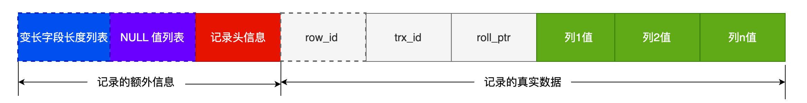

# 小林coding

## MySQL总体架构图


分为Server层和存储引擎层

- Server层负责连接、分析、执行SQL。包括**连接器、查询缓存（8.0后取消）、解析器、预处理器、优化器、执行器**等。
- 存储引擎层负责数据的存储和提取。主流的存储引擎有**InnoDB、MyISAM、Memory**等，MySQL5.5之后默认的存储引擎是InnoDB。


### 连接器

MySQL是基于TCP协议传输的

```nginx
mysql -h$ip -u$user -p  	# 连接命令
mysql> show processlist;	# 查看服务被多少个客户端连接
mysql> kill connection +id	# 手动断开空闲连接
```

`wait_timeout`控制空闲连接的最大空闲时长，默认8小时，超过此时间连接器会自动断开该连接（也可以手动断开）。

` max_connections`控制最大连接数。

MySQL如HTTP一般也有短链接和长连接的区别，一般推荐使用长连接，减少建立和断开的过程。但是**长连接会占用内存**。解决方式：1、定期断开长连接；2、客户端主动重置连接：MySQL 5.7 版本实现了`mysql_reset_connection()` 函数的接口，不需要重连和重新鉴权，但是可以释放内存。

> **总结**
>
> - 与客户端进行 TCP 三次握手建立连接；
> - 校验客户端的用户名和密码，如果用户名或密码不对，则会报错；
> - 如果用户名和密码都对了，会读取该用户的权限，然后后面的权限逻辑判断都基于此时读取到的权限；


### 查询缓存

对于更新比较频繁的表，查询缓存的命中率很低的，因为只要一个表有更新操作，那么这个表的查询缓存就会被清空。因此，**MySQL 8.0**直接将查询缓存删掉了。


### 解析器

- **词法分析**：识别SQL语句关键字，构建SQL语法树
- **语法分析**：判断语句是否合乎语法


### 预处理器

- 检查表或字段是否存在
- 将 `select *` 中的 `*` 符号，扩展为表上的所有列


### 优化器

**优化器主要负责将 SQL 查询语句的执行方案确定下来**，比如在表里面有多个索引的时候，优化器会基于查询成本的考虑，来决定选择使用哪个索引。

要想知道优化器选择了哪个索引，我们可以在查询语句最前面加个 `explain` 命令。

```mysql
explain select * from table where id = 1;
```


### 执行器

确认用户权限后，根据执行计划执行 SQL 查询语句，从存储引擎读取记录，返回给客户端

- 主键索引查询
- 全表扫描
- 索引下推（MySQL 5.6 推出的查询优化策略）：索引下推能够减少**二级索引**在查询时的回表操作，提高查询的效率，因为它将 Server 层部分负责的事情，交给存储引擎层去处理了。


## MySQL一行记录的存储结构

### 存放的文件

- db.opt：存储当前数据库的默认字符集和字符校验规则（8.0版本后无）
- 表名.frm：存放该表的表结构（8.0版本后无）
- 表名.ibd：存放该表的表数据


### 表空间文件结构


一条记录按行存储，但是按页来读写

页是 InnoDB 存储引擎磁盘管理的最小单元。每个页默认大小为16kb

但在表中数据量大的时候，为某个索引分配空间的时候就不再按照页为单位分配了，而是按照**区（extent）**为单位分配。每个区的大小为 1MB，对于 16KB 的页来说，连续的 64 个页会被划为一个区，这样就使得链表中相邻的页的物理位置也相邻，就能使用顺序 I/O 了。

段被分为**索引段、数据段、回滚段**，索引段存放B+树非叶子节点的区的集合；数据段存放B+树叶子节点的区的集合；回滚段存放的是回滚数据的区的集合。


### InnoDB行格式

- **Redundant**：5.0版本前古老的行格式
- **Compact**：紧凑的行格式，一个数据也可以存放更多行记录
- **Dynamic、Compressed**：类似Compact，5.7版本后默认Dynamic


### Compact行格式



#### 记录的格外信息

##### 1. 变长字段长度列表

char 是定长的，varchar 是变长的。因此这个字段存放的是`varchar`型的字段。但这个字段不是必须的，如果数据表没有`varchar`型字段，就不需要这个列表。

变长字段的真实数据占用的字节数会按照列的顺序**逆序存放**。

NULL不会存放在行格式中记录的真实数据部分里，因此变长字段长度列表里不需要保存值为 NULL 的变长字段的长度。

> **为什么「变长字段长度列表」的信息要按照逆序存放？**
>
> 这样可以使得位置靠前的记录的真实数据和数据对应的字段长度信息可以同时在一个 CPU Cache Line 中，这样就可以提高 CPU Cache 的命中率。

##### 2. NULL值列表

同样需要**逆序存放**。同样也不是必须的，如果数据表所有字段都是NOT NULL，就不需要这个列表。

如果存在允许 NULL 值的列，则每个列对应一个二进制位（bit）。NULL 值列表必须用整数个字节的位表示（1字节8位），如果使用的二进制位个数不足整数个字节，则在字节的高位补0。

##### 3. 记录头信息

- delete_mask：标识此条数据是否被删除。删除了标记为1。
- next_record：下一条记录的位置。从这里可以知道，记录与记录之间是通过链表组织的。
- record_type：表示当前记录的类型，0表示普通记录，1表示B+树非叶子节点记录，2表示最小记录，3表示最大记录。

#### 记录的真实数据

三个隐藏字段：

- row_id：如果我们建表的时候指定了主键或者唯一约束列，那么就没有row_id隐藏字段了。如果既没有指定主键，又没有唯一约束，那么InnoDB就会为记录添加row_id隐藏字段。row_id**不是必需**的，占用6个字节。

- trx_id：事务id，表示这个数据是由哪个事务生成的。trx_id**是必需**的，占用6个字节。

- roll_pointer：这条记录上一个版本的指针。roll_pointer是必需**的，占用7个字节。


### varchar(n)中n的最大取值

**MySQL 规定除了 TEXT、BLOBs 这种大对象类型之外，其他所有的列（不包括隐藏列和记录头信息）占用的字节长度加起来不能超过 65535 个字节**。65535限制的是一行总长度，不是一列。

varchar(n)字段类型的n代表的是最多存储的**字符数量**，并不是字节大小。要算varchar(n)最大能允许存储的字节数，还要**看数据库表的字符集**，比如ascii字符集，1个字符占用1字节，那么varchar(100)意味着最大能允许存储100字节的数据。

一行数据最大字节 = **变长字段长度列表 + NULL 值列表 + varchar(n)** 所占用字节数

> - 如果变长字段允许存储的最大字节数小于等于255字节，就会用1字节表示变长字段长度；
> - 如果变长字段允许存储的最大字节数大于255字节，就会用2字节表示变长字段长度；


### 行溢出的处理方式

一个页最多存16384字节，一个varchar(n)最多存65532字节，则一个页可能存不下一条记录，这时会发生行溢出，多出来的数据会被存到**溢出页**中。在真实数据页处用20字节指向溢出页地址。


## 索引

### 索引分类

- 按「数据结构」分类：**B+tree索引、Hash索引、Full-text索引**。
- 按「物理存储」分类：**聚簇索引（主键索引）、二级索引（辅助索引）**。<font color=red>（B+树）?</font>
- 按「字段特性」分类：**主键索引、唯一索引、普通索引、前缀索引**。
- 按「字段个数」分类：**单列索引、联合索引**。

#### 按数据结构分类


在创建表时，InnoDB 存储引擎会根据不同的场景选择不同的列作为索引：

- 如果有主键，默认会使用主键作为聚簇索引的索引键（key）；
- 如果没有主键，就选择第一个不包含 NULL 值的唯一列作为聚簇索引的索引键（key）；
- 在上面两个都没有的情况下，InnoDB 将自动生成一个隐式自增 id 列作为聚簇索引的索引键（key）；

其它索引都属于辅助索引（Secondary Index），也被称为二级索引或非聚簇索引。**创建的主键索引和二级索引默认使用的是 B+Tree 索引**。

> **索引数据结构对比**
>
> 1. B+树 vs B树
>    B+树只在叶子节点存储数据，而B树的非叶子节点也要存储数据，所以B+树的单个节点的数据量更小，在相同的磁盘I/O次数下，就能查询更多的节点。另外，B+树叶子节点采用的是双链表连接，适合MySQL中常见的基于范围的顺序查找，而B树无法做到这一点。
>
> 2. B+树 vs 二叉树
>    对于有N个叶子节点的B+树，其搜索复杂度为$O(log_dN)$，实际情况下，d值大于100。而二叉树搜索复杂度为$O(logN)$，需要更多I/O次数。
>
> 3. B+树 vs 哈希
>    Hash 在做等值查询的时候效率贼快，搜索复杂度为 O(1)。但是 Hash 表不适合做范围查询，它更适合做等值的查询。

#### 按物理存储分类

分为主键索引（聚簇索引）和二级索引（辅助索引）

二级索引B+树叶子节点存放的是主键值，因此如果查询的数据在二级索引里查询不到，就需要返回到主键索引树继续查找，这个过程叫做回表。

#### 按字段特性分类

分为主键索引、唯一索引、普通索引、前缀索引。

##### 主键索引

一张表最多只有一个主键索引，索引列的值不允许有空值。

```mysql
CREATE TABLE table_name  (
  ....
  PRIMARY KEY (index_column_1) USING BTREE
);
```

##### 唯一索引

是建立在UNIQUE字段上的索引，一张表可以有多个唯一索引，索引列的值必须唯一，但是允许有空值。

```mysql
# 建表时创建唯一索引
CREATE TABLE table_name  (
  ....
  UNIQUE KEY(index_column_1,index_column_2,...) 
);
# 建表后创建唯一索引
CREATE UNIQUE INDEX index_name
ON table_name(index_column_1,index_column_2,...);
```

##### 普通索引

是建立在普通字段上的索引，既不要求字段为主键，也不要求字段为 UNIQUE。

```mysql
# 建表时创建普通索引
CREATE TABLE table_name  (
  ....
  INDEX(index_column_1,index_column_2,...) 
);
# 建表后创建普通索引
CREATE INDEX index_name
ON table_name(index_column_1,index_column_2,...); 
```

##### 前缀索引

前缀索引是指对字符类型字段的前几个字符建立的索引，而不是在整个字段上建立的索引，前缀索引可以建立在字段类型为 char、 varchar、binary、varbinary 的列上。使用前缀索引的目的是为了**减少索引占用的存储空间**，提升查询效率。

```mysql
# 建表时创建前缀索引
CREATE TABLE table_name(
    column_list,
    INDEX(column_name(length))
); 
# 建表后创建前缀索引
CREATE INDEX index_name
ON table_name(column_name(length)); 
```

#### 按字段个数分类

分为单列索引、联合索引（复合索引）

- 建立在单列上的索引称为单列索引，比如主键索引
- 建立在多列上的索引称为联合索引

```mysql
CREATE INDEX index_product_no_name ON product(product_no, name);
# 联合索引查询的 B+Tree 是先按 product_no 进行排序，然后再 product_no 相同的情况再按 name 字段排序。
```

##### 最左匹配原则

按照最左优先的方式进行索引的匹配。在使用联合索引进行查询的时候，如果不遵循最左匹配原则，联合索引会失效，这样就无法利用到索引快速查询的特性了。

##### 联合索引范围查询几个例子

**1.  `select * from t_table where a > 1 and b = 2`，联合索引（a, b）**
	a : 按a字段排序，因此符合a > 1的肯定相邻，所以a字段使用了联合索引查询
	b : 但是a > 1的条件里，b是无序的，所以b没有用到联合索引查询

**2. `select * from t_table where a >= 1 and b = 2`，联合索引（a, b）**
	a : 同理a字段使用了联合索引查询
	b : 虽然在a > 1的条件里，b是无序的，但是在a = 1的条件里，b是有序的，所以b用到了联合索引查询

**3. `SELECT * FROM t_table WHERE a BETWEEN 2 AND 8 AND b = 2`，联合索引（a, b）**
	a : 使用了
	b : 使用了

**4. `SELECT * FROM t_user WHERE name like 'j%' and age = 22`，联合索引（name, age）**
	name : 前缀为j的肯定相邻，所以使用了，相当于['j', 'k')
	age : 在符合前缀为 ‘j’ 的 name 字段的二级索引记录的范围里，age 字段的值是无序的，但是对于符合 name = j 的二级索引记录的范围里，age字段的值是有序的，所以可以从符合 `name = 'j' and age = 22` 条件的第一条记录时开始扫描，而不需要从第一个 name 为 j 的记录开始扫描（不需要扫描 `name = j and age < 22` 的记录了）。

##### 索引下推

MySQL5.6引入了**索引下推优化**（index condition pushdown)， **可以在联合索引遍历过程中，对联合索引中包含的字段先做判断，直接过滤掉不满足条件的记录，减少回表次数**。

##### 索引区分度

建立联合索引时，要把区分度大的字段排在前面，这样区分度大的字段越有可能被更多的 SQL 使用到。

##### 联合索引可以排序

例子：`select * from order where status = 1 order by create_time asc`

通过索引提高查询效率的方式是：给status和create_time作一个联合索引，这样根据status筛选后的数据就是按照create_time排好序的，否则若单独给status作索引，筛选出数据后还要单独给create_time排序。**要避免 MySQL 数据库发生文件排序**。


### 索引的缺点

- 需要占用物理**空间**，数量越大，占用空间越大；
- 创建索引和维护索引要耗费**时间**，这种时间随着数据量的增加而增大；
- 会**降低表的增删改的效率**，因为每次增删改索引，B+树为了维护索引有序性，都需要进行动态维护。


### 索引的使用场景

#### 适用场景

- 字段有**唯一性**限制的，比如商品编码；
- **经常用于 `WHERE` 查询条件**的字段，这样能够提高整个表的查询速度，如果查询条件不是一个字段，可以建立联合索引。
- **经常用于 `GROUP BY` 和 `ORDER BY`** 的字段，这样在查询的时候就不需要再去做一次排序了，因为我们都已经知道了建立索引之后在 B+Tree 中的记录都是排序好的。

#### 不适用场景

- 查得少，增删改得多的字段。
- 字段中存在大量重复数据，不需要创建索引，比如性别字段。
- 表数据太少的时候，不需要创建索引；


### 优化索引的方法

#### 前缀索引优化

使用前缀索引是为了减小索引字段大小，可以增加一个索引页中存储的索引值，有效提高索引的查询速度。

#### 覆盖索引优化

覆盖索引是指 SQL 中 query 的所有字段，在索引 B+Tree 的叶子节点上都能找得到的那些索引，从二级索引中查询得到记录，而不需要通过聚簇索引查询获得，可以避免回表的操作。

#### 主键索引最好是自增的

**如果使用自增主键**，那么每次插入的新数据就会按顺序添加到当前索引节点的位置，不需要移动已有的数据，当页面写满，就会自动开辟一个新页面。因为每次**插入一条新记录，都是追加操作，不需要重新移动数据**，因此这种插入数据的方法效率非常高。

**如果使用非自增主键**，由于每次插入主键的索引值都是随机的，因此每次插入新的数据时，就可能会插入到现有数据页中间的某个位置，这将不得不移动其它数据来满足新数据的插入，甚至需要从一个页面复制数据到另外一个页面，我们通常将这种情况称为**页分裂**。**页分裂还有可能会造成大量的内存碎片，导致索引结构不紧凑，从而影响查询效率**。

#### 防止索引失效

##### 失效场景

- 使用左或者左右模糊匹配时，也就是`like %xx`或者`like %xx%`；
- 当在查询条件中对索引列做了计算、函数、类型转换操作；
- 不按照最左优先的方式进行索引的匹配；
- 在`WHERE`子句中，如果在`OR`前的条件列是索引列，而在`OR`后的条件列不是索引列，那么索引会失效。

> **总结**
>
> 
