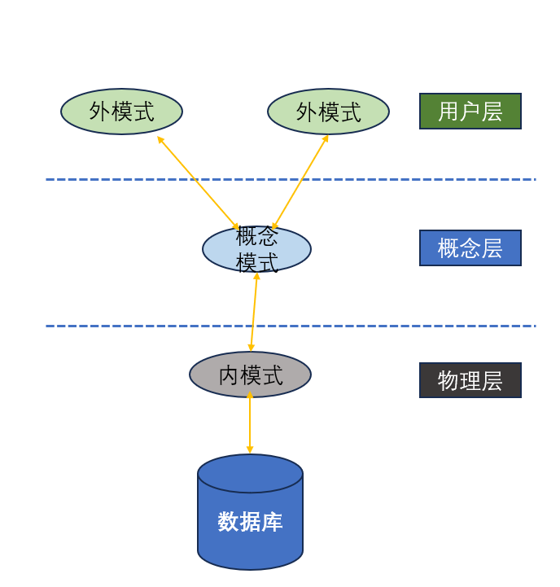
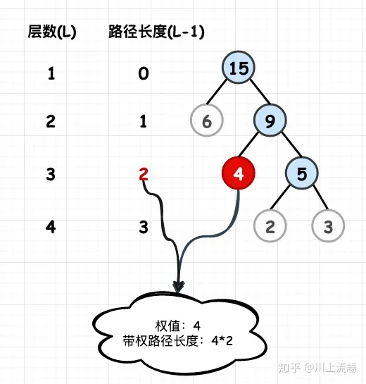
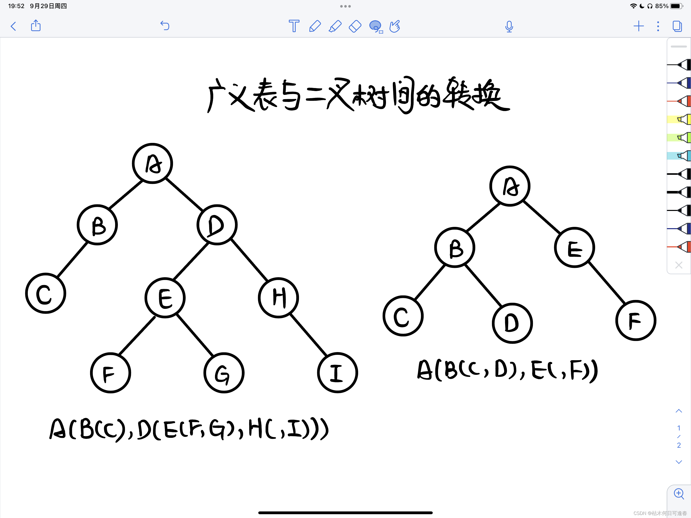

## 拓扑排序？

>  

## 各种排序算法？

> 

## 9.2 oppo笔试

### 列优先

m行n列数组A\[m\][n]，求A\[i][j]

行优先：i * n + j

列优先：j * m + i

### 三次握手目的

三次握手的目的是为了确认客户端和服务端的接收能力和发送能力

### SPOOLing

外部设备联机并行操作，假脱机技术

将独占设备变为共享设备

空间换时间

### RTT是不是一来一回

是的

### 数据库内模式

##### 内模式

也称存储模式（Storage Schema），内模式是整个数据库的最低层表示，不同于物理层，它假设外存是一个无限的线性地址空间，内模式定义的是存储记录的类型、存储域的表示以及存储记录的物理顺序，指引元、索引和存储路径等数据的存储组织。
例如，记录的存储方式是顺序存储、按照B树结构存储还是按hash方法存储；索引按照什么方式组织；数据是否压缩存储，是否加密；数据的存储记录结构有何规定）。一个数据库只有**一个**内模式。

##### 概念模式

概念模式（也称模式、逻辑模式）用以描述整个数据库中数据库的逻辑结构，描述现实世界中的实体及其性质与联系，定义记录、数据项、数据的完整性约束条件及记录之间的联系，是数据项值的框架。
数据库系统概念模式通常还包含有访问控制、保密定义、完整性检查等方面的内容，以及概念/物理之间的映射。
概念模式是数据库中全体数据的逻辑结构和特征的描述
一个数据库只有**一个**概念模式。

##### 外模式

也称子模式（Subschema）或用户模式，是数据库用户（包括应用程序员和最终用户）能够看见和使用的局部数据的逻辑结构和特征的描述，是数据库用户的数据视图，常常是与某一应用有关的数据的逻辑表示。这种处理方式不仅可以提高数据对用户的价值，同时还可以保证数据的安全。
一个数据库可以有**多个**外模式。

### fdisk 磁盘分区

`fdisk -l` 查看所有磁盘

`fdisk [文件名]`，输入`n`表示新建分区；输入`p`表示建立一个原始分区；输入`1`表时此区编号为1；输入`回车` 表示此区从默认起始柱面号开始；输入回车/或大小 表示此区以默认/或输入的大小结束；输入`w`保存

### 哈夫曼树

#### 带权路径长度

#### 构造

每次都选取最小的两个结点构造成子树，加入到森林中

哈夫曼只有0个或2个孩子

### DNS 邮件服务器

❌忘了问题是什么

## 9.3 灵犀互娱

### 游戏客户端、服务器

❌忘了问题

### 有向无环图的最大边数

n*(n-1)/2

### 管程

> 

## 9.4 招商银行

### 增量开发模型

增量开发模型是一种迭代的软件模型，将待开发的软件系统模块化，将每个模块作为一个增量组件，从而分批次地分析、设计、编码和测试这些增量组件1。

增量开发模型的特点1：

1. 把待开发的软件系统模块化，将每个模块作为一个增量组件。
2. 分批次地分析、设计、编码和测试这些增量组件。
3. 相对于瀑布模型而言，采用增量模型进行开发，开发人员不需要一次性地把整个软件产品提交给用户，而是可以分批次进行提交。

####  几个开发模型

1. 瀑布模型：从系统需求分析开始直到产品发布和维护，每个阶段都会产生循环反馈。如果有信息未被覆盖或者发现了问题，那么最好“返回”上一个阶段并进行适当的修改，项目开发进程从一个阶段“流动”到下一个阶段。
2. 边做边改模型：遗憾的是，许多产品都是使用"边做边改"模型。
3. 快速原型模型：快速构造一个原型（主要功能和重要接口），在该原型的基础上，迭代性逐渐完成整个系统的开发工作。
4. 增量模型：是一种非整体开发的模型，分为基于瀑布模型的渐增模型和基于原型的快速原型模型。
5. 螺旋模型：将瀑布模型和增量模型结合起来，并加入了风险分析。
6. 喷泉模型：一种以用户需求为动力，以对象为驱动的模型，主要用于描述面向对象的软件开发过程。

### 抽象类方法

> 

### 极限编程

> 

### 代理、桥接、原型、组合模式

> 

### 广义表

> 

### top命令的total

✔交换分区的总大小

❓占用的总内存

 

## 9.6 深信服

### 分割回文串

>  https://leetcode.cn/problems/palindrome-partitioning/solutions/639633/fen-ge-hui-wen-chuan-by-leetcode-solutio-6jkv/

### 正则表达式（复杂度O(mn)或更优）

> 

### 哈希查找，拉链法，时间复杂度

> 

### 双链表实现LRU，缓存队列满或不满，分别需要几次遍历

> 

### 逆序对

> 

## 9.8 联想

### 多项式公式

$C_n^m = \frac{n!}{m!(n-m)!}$  $C_n^0 = 1$

### arp、rarp协议

ARP：IP → MAC

RARP：MAC → IP

### RIPV2协议

**RIPv1的特点：**

- 广播更新；
- 有类协议(A、B、C类)，不支持不连续子网；
- 不支持CIDR和VLSM；
- 不支持认证，自动聚合；

**RIPv2的特点：**

- 组播更新(224.0.0.9)；
- 无类协议，支持不连续协议；
- 支持认证，支持手动汇总；
- 支持CIDR和VLSM；

### 汉诺塔

> 

### 哈希查找装填因子

> 

### 广义表转二叉树

### ps.executeUpdate

execute、 executeUpdate、 executeQuery三者的区别 (及返回值)

1.`ResultSet` executeQuery(String sql);执行SQL查询，并返回ResultSet 对象

2.`int` executeUpdate(String sgl):可执行增，删，改，返回执行受到影响的行数

3.`boolean` execute(String sal);可执行任何SQL语句，返回一个布尔值，表示是否返回ResultSet.
