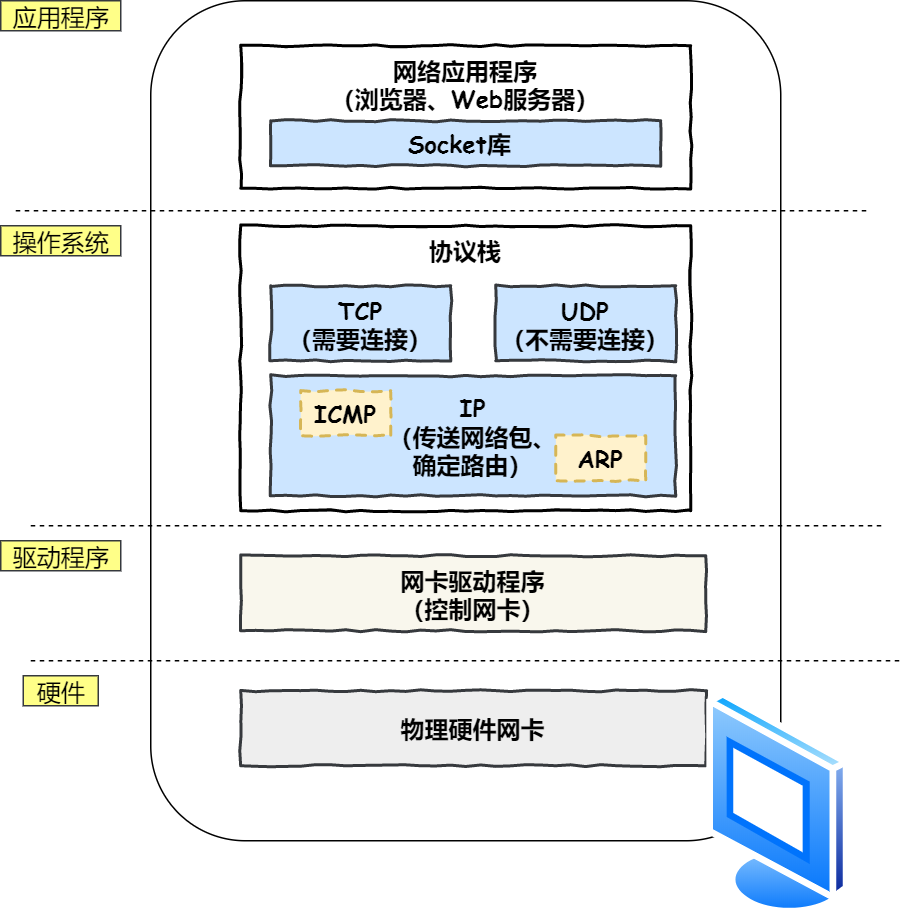
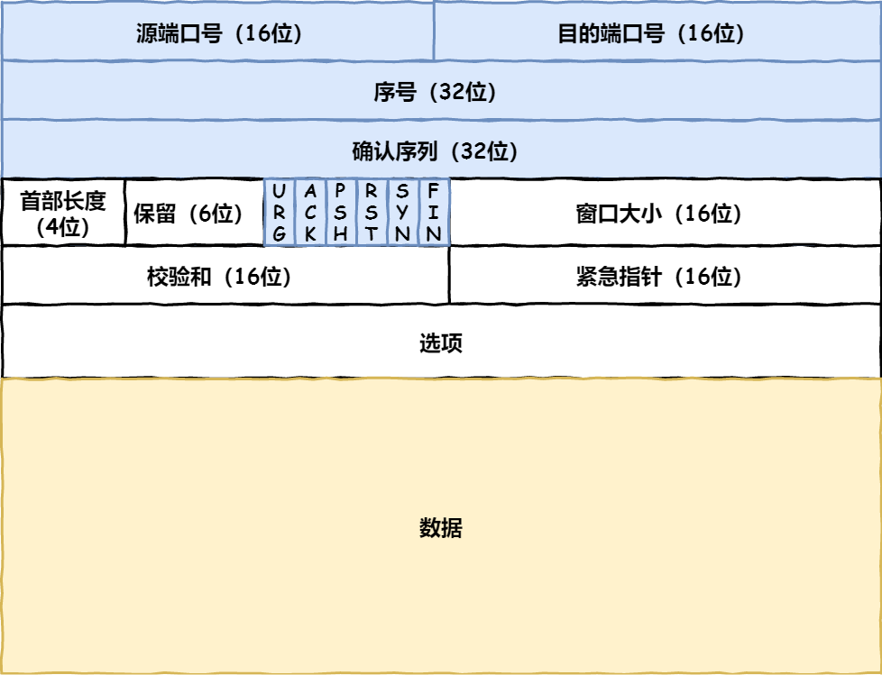
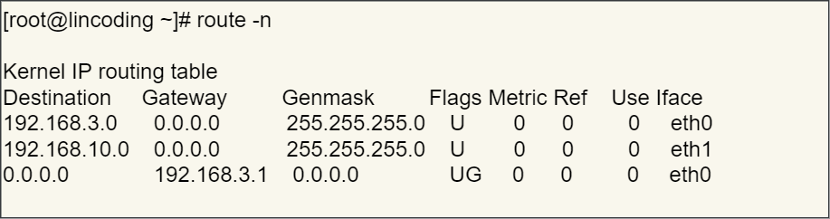
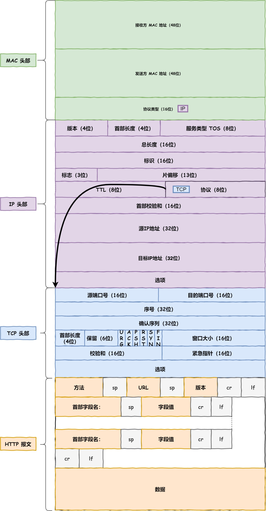
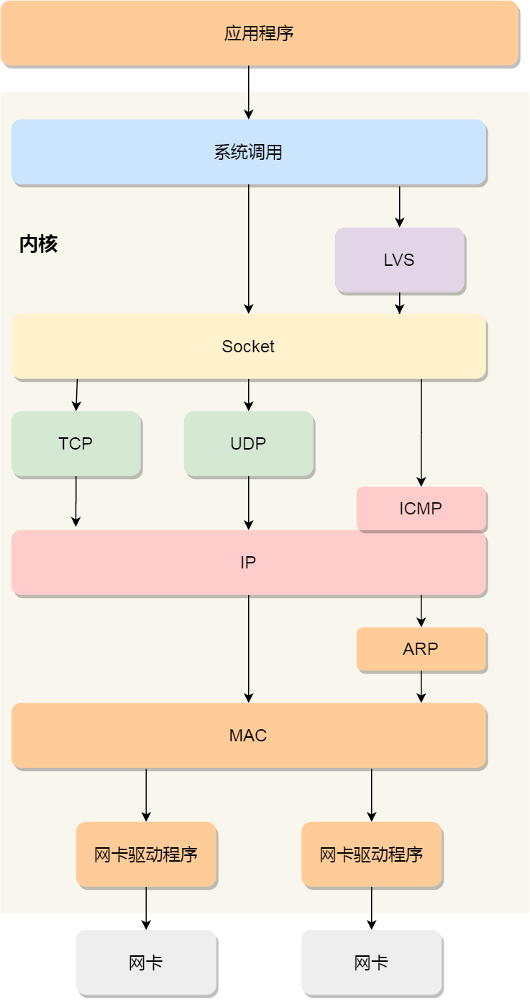
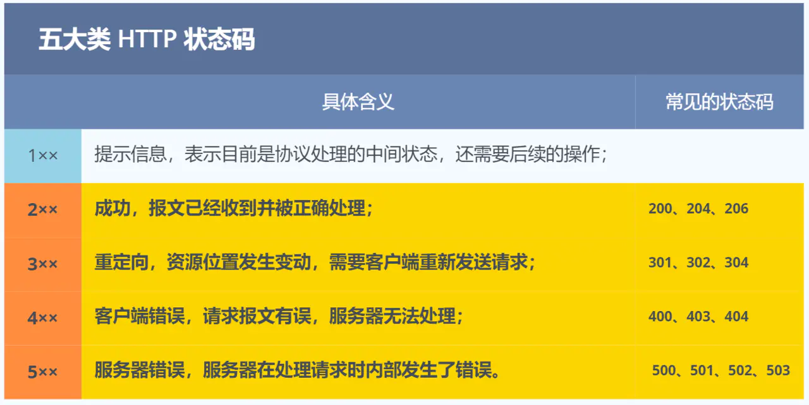
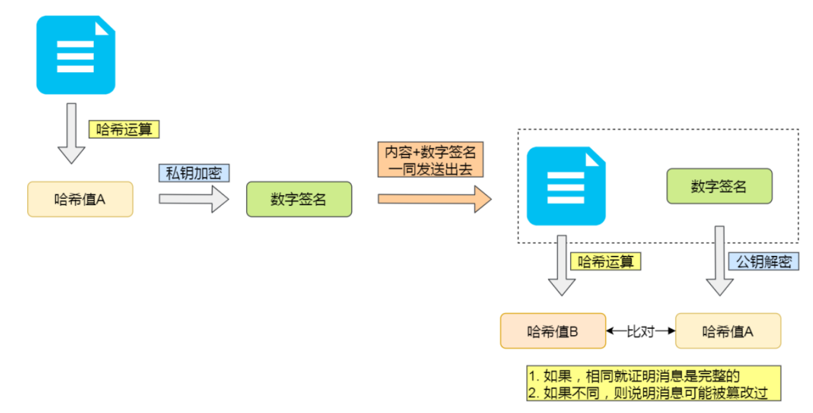

# 小林coding

## OSI七层模型

- 应用层，负责给应用程序提供统一的接口；
- 表示层，负责把数据转换成兼容另一个系统能识别的格式；
- 会话层，负责建立、管理和终止表示层实体之间的通信会话；
- 传输层，负责端到端的数据传输；
- 网络层，负责数据的路由、转发、分片；
- 数据链路层，负责数据的封帧和差错检测，以及 MAC 寻址；
- 物理层，负责在物理网络中传输数据帧；


## TCP/IP网络模型

- 应用层，负责向用户提供一组应用程序，比如 HTTP、DNS、FTP 等;
- 传输层，负责端到端的通信，比如 TCP、UDP 等；
- 网络层，负责网络包的封装、分片、路由、转发，比如 IP、ICMP 等；
- 网络接口层，负责网络包在物理网络中的传输，比如网络包的封帧、 MAC 寻址、差错检测，以及通过网卡传输网络帧等；


### 应用层

> 协议：HTTP（超文本传输协议）、FTP（文件传输协议）、Telnet（Internet远程登陆服务的标准协议）、DNS（域名系统）、SMTP（电子邮件传输协议）

应用层在用户态，传输层及以下在内核态。


### 传输层

> 协议：TCP（传输控制协议）、UDP（用户数据报协议）

TCP相比UDP多了流量控制、超时重传、拥塞控制等特性，保证数据包能可靠地传输给对方。

UDP不保证数据包是否可以抵达对方，但是它的实时性相对更好，传输效率也高。

MSS(最大报文段长度)：TCP连接建立时协商的每一个TCP报文段所能承载的最大数据长度（不包括头部）。

> 各个端口对应的服务
>
> 21：FTP
> 23：Telnet
> 25：SMTP
> 53：DNS
> 80：HTTP
> 443：HTTPS
> 8080：WWW，网页


### 网络层

> 协议：IP协议、ARP（地址解析协议）、ICMP（Internet控制报文协议）

MTU（最大传输单元）：发送方所能接受的数据报最大长度（单位为字节），超过MTU可能会被路由器拒绝转发。MTU是加上了IP头部的长度，以太网中一般为1500字节。

IPv4共有32位，IPv6有128位。将IP地址分为网络号和主机号，用子网掩码和ip地址进行按位与计算，可以得到网络号。`10.100.122.0/24`，后面的`/24`表示就是 `255.255.255.0` 子网掩码。

**IP 协议的寻址作用是告诉我们去往下一个目的地该朝哪个方向走，路由则是根据「下一个目的地」选择路径。寻址更像在导航，路由更像在操作方向盘**。


### 数据链路层

> 协议：IP协议、ARP（地址解析协议）


### 各层数据的传输单位

- 网络接口层的传输单位是帧（frame）
- IP 层的传输单位是包（packet）
- TCP 层的传输单位是段（segment）
- HTTP 的传输单位则是消息或报文（message）


## 键入网址到网页显示，期间发生了什么？

### HTTP

1. 解析URL
2. 生成HTTP请求报文


### DNS

查询目标服务器域名对应的IP地址

浏览器和操作系统的缓存中都会存储


### 协议栈

通过DNS获取到目的IP后，就可以把HTTP的传输工作交给操作系统中的**协议栈**。



### TCP

#### 报文头部



状态位：`SYN` 是发起一个连接，`ACK` 是回复，`RST` 是重新连接，`FIN` 是结束连接。

#### 查看TCP连接状态的命令

```nginx
netstat -napt
```


### IP

#### 填写源IP地址

假设客户端有多个网卡，就会有多个 IP 地址，在填写源地址 IP 时，就需要判断到底应该填写哪个地址。这个判断相当于在多块网卡中判断应该使用哪个一块网卡来发送包。**这个时候就需要根据路由表规则，来判断哪一个网卡作为源地址 IP。**

```nginx
route -n  # 查看路由表
```



eth0, eth1是网卡。

目标地址和子网掩码都是 `0.0.0.0`表示**默认网关**，如果其他所有条目都无法匹配，就会自动匹配这一行。并且后续就把包发给路由器，`Gateway` 即是路由器的 IP 地址。


#### IP报文生成

](网络.assets/17.jpg)


### MAC

在 MAC 包头里需要发送方 MAC 地址和接收方目标 MAC 地址，用于**两点之间的传输**。

MAC 包头的**协议类型**包括：`0800`：IP 协议、`0806`：ARP 协议。

发送包时要获取对方MAC地址：

- 先查询 **ARP 缓存**，如果其中已经保存了对方的 MAC 地址，就不需要发送 ARP 查询，直接使用 ARP 缓存中的地址。
- 而当 ARP 缓存中不存在对方 MAC 地址时，则发送 ARP 广播查询。

至此，报文如下图：




### 网卡

网络包只是存放在内存中的一串二进制数字信息，没有办法直接发送给对方。因此，我们需要将**数字信息转换为电信号**，才能在网线上传输。负责执行这一操作的是**网卡**，要控制网卡还需要靠**网卡驱动程序**。

网卡驱动获取网络包之后，会将其**复制**到网卡内的缓存区中，接着会在其**开头加上报头和起始帧分界符，在末尾加上用于检测错误的帧校验序列**。


### 交换机

交换机将网络包**原样**转发到目的地。交换机工作在 MAC 层，也称为**二层网络设备**。

> **交换机与网卡区别**
>
> 计算机的**网卡本身具有 MAC 地址**，并通过核对收到的包的接收方 MAC 地址判断是不是发给自己的，如果不是发给自己的则丢弃；
>
> 相对地，交换机的端口不核对接收方 MAC 地址，而是直接接收所有的包并存放到缓冲区中。因此，和网卡不同，**交换机的端口不具有 MAC 地址**。

#### 广播地址

- MAC 地址中的 `FF:FF:FF:FF:FF:FF`
- IP 地址中的 `255.255.255.255`


### 路由器

> **路由器与交换机区别**
>
> **路由器**是基于 IP 设计的，俗称**三层**网络设备，路由器的各个端口都具有 MAC 地址和 IP 地址，类似网卡；
>
> **交换机**是基于以太网设计的，俗称**二层**网络设备，交换机的端口不具有 MAC 地址。

#### 接收包

错误校验后，检查MAC头部的接收方MAC地址，丢弃不是发给自己的包。

接收包后，丢弃MAC头部。因为**MAC 头部的作用就是将包送达路由器**，其中的接收方 MAC 地址就是路由器端口的 MAC 地址。因此，当包到达路由器之后，MAC 头部的任务就完成了。

#### 转发包

根据路由表转发，如果网关是一个IP地址，则这个IP地址就是我们要转发到的目标地址，说明还未抵达终点要继续转发，否则已抵达终点。得到IP地址后也要转换成MAC地址，同样查询**ARP缓存**，如果查不到就发送ARP查询。

**源 IP 和目标 IP 始终是不会变的，一直变化的是 MAC 地址**，因为需要 MAC 地址在以太网内进行**两个设备**之间的包传输。


## Linux收发网络包

Linux网络协议栈



- 应用程序需要通过系统调用，来跟 Socket 层进行数据交互；
- Socket 层的下面就是传输层、网络层和网络接口层；
- 最下面的一层，则是网卡驱动程序和硬件网卡设备；

每当网卡收到一个网络包，就触发一个中断告诉操作系统有一个网络包已到达。但是频繁触发中断会影响系统的整体效率。因此Linux 内核在 2.6 版本中引入了 **NAPI 机制**，它是**混合「中断和轮询」**的方式来接收网络包，它的核心概念就是**不采用中断的方式读取数据**，而是首先采用中断唤醒数据接收的服务程序，然后 `poll` 的方法来轮询数据。因此，当有网络包到达时，会通过 DMA 技术，将网络包写入到指定的内存地址，接着网卡向 CPU 发起硬件中断，当 CPU 收到硬件中断请求后，根据中断表，调用已经注册的中断处理函数。

RingBuffer


## HTTP

### 常见的HTTP状态码



- **2xx**  成功状态码
  - **200 OK**  成功
  - **204 No Content**  响应头无body数据
  - **206 Partial Content**  应用于 HTTP 分块下载或断点续传，body数据不完整
- **3xx ** 重定向
  - **301 Moved Permanently**  永久重定向，表示资源不存在了，需要改用新URL重新访问
  - **302 Found**  临时重定向，表示请求的资源还在，但暂时需要用另一个 URL 来访问
  - **304 Not Modified**  缓存重定向，客户端可以继续使用缓存过的尚未被修改的资源
- **4xx ** 客户端报文错误
  - **400 Bad Request**  笼统的错误
  - **403 Forbidden**  客户端访问了服务器端禁止访问的资源
  - **404 Not Found**  客户端请求的资源在服务器上没找到
- **5xx**  服务器端错误
  - **500 Internal Server Error**  笼统的错误
  - **501 Not Implemented**  客户端请求的功能还不支持。“即将开业，敬请期待”
  - **502 Bad Gateway**  错误的网关，表示服务器自身正常，但是访问后端服务器发生了错误
  - **503 Service Unavailable**  表示服务器当前很忙，暂时无法响应。“网络服务正忙，请稍后重试”


### 常见的HTTP字段

#### Host

客户端指定服务器的域名。可以发往同一台服务器上的不同网站。

#### Content-Length

服务器返回数据时所带，表明本次回应的资源长度。

HTTP 协议通过设置**回车符、换行符作为 HTTP header 的边界**，通过 **Content-Length 字段作为 HTTP body 的边界**，这两个方式都是为了**解决“粘包”的问题**。

#### Connection

指定长连接Keep-Alive

#### Content-Type

服务器告诉客户端，本次数据是什么格式。

#### Content-Encoding

服务器返回的数据使用了什么压缩格式


### GET与POST区别

GET 的语义是从服务器获取指定的资源，POST 的语义是根据请求负荷（报文body）对指定的资源做出处理。

> - 在 HTTP 协议里，所谓的「安全」是指请求方法不会「破坏」服务器上的资源。
> - 所谓的「幂等」，意思是多次执行相同的操作，结果都是「相同」的。

GET方法是**安全且幂等**的，因为它是只读操作。

POST方法是**不安全且不幂等**的。


### HTTP的缓存技术

#### 强制缓存

只要浏览器判断缓存没有过期，则直接使用浏览器的本地缓存，决定是否使用缓存的主动性在于浏览器这边。

强缓存是利用下面这两个 HTTP 响应头部（Response Header）字段实现的，它们都用来表示资源在客户端缓存的有效期：`Cache-Control`， 是一个相对时间；`Expires`，是一个绝对时间。Cache-Control 的优先级高于 Expires。

浏览器第一次请求资源时，服务器会在响应头**加上Cache-Control**；再次访问时，就会计算该资源是否过期，若过期就重新请求，否则直接使用缓存。服务器再次收到请求后，会**更新Cache-Control**。

#### 协商缓存

客户端与服务端协商之后，通过协商结果来判断是否使用本地缓存。


### HTTP各版本特性

HTTP/1.1，HTTP/2.0，HTTP/3.0

#### HTTP/1.1

##### 优点

- 简单

  HTTP 基本的报文格式就是 `header + body`，头部信息也是 `key-value` 简单文本的形式，**易于理解**，降低了学习和使用的门槛。

- 灵活和易于扩展

  HTTP 协议里的各类请求方法、URI/URL、状态码、头字段等每个组成要求都没有被固定死，都允许开发人员**自定义和扩充**。

  HTTP 工作在应用层（ `OSI` 第七层），它**下层可以随意变化**。

- 应用广泛和跨平台

##### 缺点

- 无状态（双刃剑）

  **好处是**由于不需要额外资源来记录状态信息，因此可以减轻服务器负担。

  **坏处是**由于没有记忆能力，因此在完成有关联性操作时会十分麻烦。

  **解决：Cookie**

- 明文传输

- 不安全

  - 通信使用明文不加密，内容可能被窃听（号没了）
  - 不验证身份，可能遭遇伪装（钱没了）
  - 无法验证报文完整性，信息可能被篡改（眼睛脏了）

  **解决：HTTPS**

##### 性能

- 长连接。HTTP/1.0 每发起一个请求都要建立一次TCP连接，HTTP/1.1 增加了长连接的通信方式。
- 管道传输。客户端发送请求时不需要先等待前面请求的应答报文。但是**服务器必须按照接收请求的顺序发送对这些管道化请求的响应**，也就是需要按序应答。
- 问题：
  - 请求 / 响应头部（Header）未经压缩就发送，首部信息越多延迟越大。只能压缩 `Body` 的部分；
  - 发送冗长的首部。每次互相发送相同的首部造成的浪费较多；
  - 服务器是按请求的顺序响应的，如果服务器响应慢，会招致客户端一直请求不到数据，也就是队头阻塞；
  - 没有请求优先级控制；
  - 请求只能从客户端开始，服务器只能被动响应。

#### HTTPS

解决 HTTP 不安全的缺陷，在 TCP 和 HTTP 网络层之间加入了 **SSL/TLS** 安全协议，使得报文能够加密传输。

##### 优点

- **信息加密**  混合（对称、非对称加密）加密，交互信息无法被窃取
- **校验机制**  摘要算法（哈希函数）+数字签名，验证报文完整性，无法篡改通信内容
- **身份证书**  服务器公钥在数字证书（权威机构），验明对方真身

> **公钥和私钥**
>
> 可以双向加解密
>
> - **公钥加密，私钥解密**。这个目的是为了**保证内容传输的安全**，因为被公钥加密的内容，其他人是无法解密的，只有持有私钥的人，才能解密出实际的内容；
> - **私钥加密，公钥解密**。这个目的是为了**保证消息不会被冒充**，因为私钥是不可泄露的，如果公钥能正常解密出私钥加密的内容，就能证明这个消息是来源于持有私钥身份的人发送的。
>
> 一般我们不会用非对称加密来加密实际的传输内容，因为非对称加密的计算比较耗费性能的。 所以非对称加密的用途主要在于**通过「私钥加密，公钥解密」的方式，来确认消息的身份**，我们常说的**数字签名算法**，就是用的是这种方式，不过私钥加密内容不是内容本身，而是**对内容的哈希值加密**。
>
> 

#### HTTP/2

改进：头部压缩、二进制格式、并发传输、服务器主动推送资源

#### HTTP/3


## HTTPS

客户端和服务器进行TCP三次握手后，再进行TLS四次握手。

### SSL/TLS 协议基本流程

- 客户端向服务器索要并验证服务器的公钥。
- 双方协商生产「会话秘钥」。
- 双方采用「会话秘钥」进行加密通信。


### TLS四次握手

1. ClientHello

   客户端向服务器发起加密通信请求。发送：（1）客户端支持的 TLS 协议版本；（2）客户端生产的随机数（`Client Random`），后面用于生成「会话秘钥」条件之一；（3）客户端支持的密码套件列表，如 RSA 加密算法.

2. ServerHello

   服务端响应请求。发送：（1）确认 TLS 协议版本，如果浏览器不支持，则关闭加密通信；（2）服务器生产的随机数（`Server Random`）；（3）确认密码套件列表；（4）**服务器的数字证书。**

3. 客户端回应

   首先通过CA公钥确认服务器的数字证书的真实性，没有问题就从数字证书种取出服务器的公钥，使用它加密报文，发送：（1）一个随机数（`pre-master key`）。该随机数会被服务器公钥加密；（2）加密通信算法改变通知；（3）客户端握手结束通知。

**本次通信的「会话秘钥」**就是用`Client Random`、`Server Random`、`pre-master key`三个随机数用协商的加密算法算出来的。

4. 服务器回应

   表示握手结束。 


